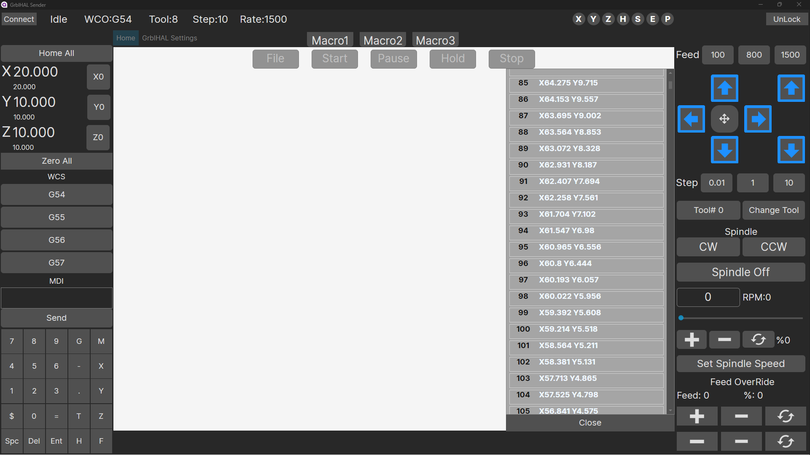
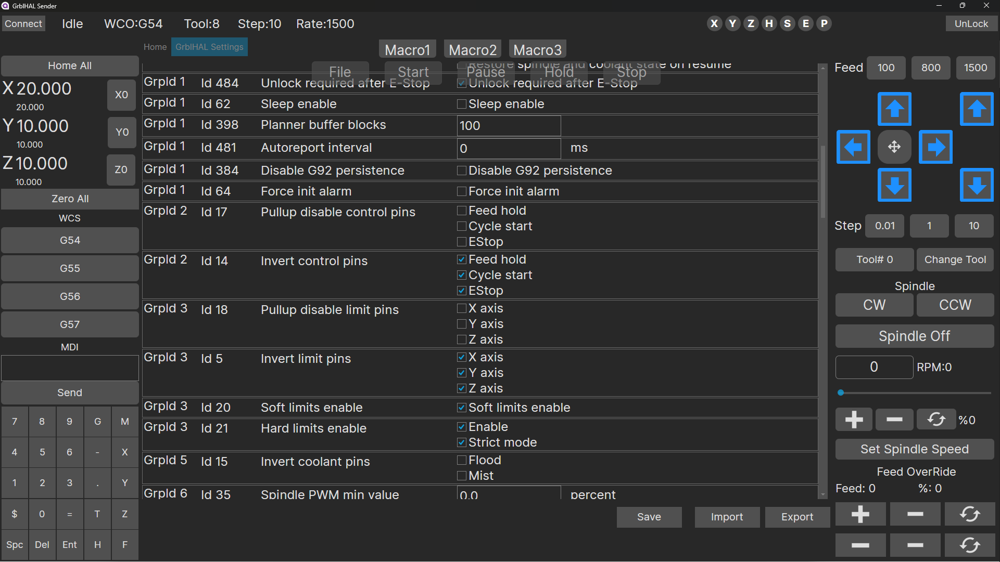

# GrblHal Sender 
Attempting  to make a  cross platform sender application designed to work with GRBLHAL.  This is a new project  starting from scrath  with a 100 percent rewrite.  Issues  starting out with limited featues it so be expeted.
  
---
Current state 23Apr  
Most of the statues  and commands are in place.
Grbl Setting and app configuration setup and working. 
Only serial communcation atm. Import and parsing Gcode in place (not ready to run jobs but close) Most of a UI is in place (will change) macro creation and running in place. NO probing ui or probing setup stm  3rd on list to start.Large pending issue is finding 3d rendering support for  back plotter implementation. 
The project is using Avalonia UI  https://avaloniaui.net/ Its a fairly new project but backed by a lot of support and  moves quickly.  So if 3d rendering has limited support now 
I do not except to be an issue for very long

Home Screen 

Setting Screen 

