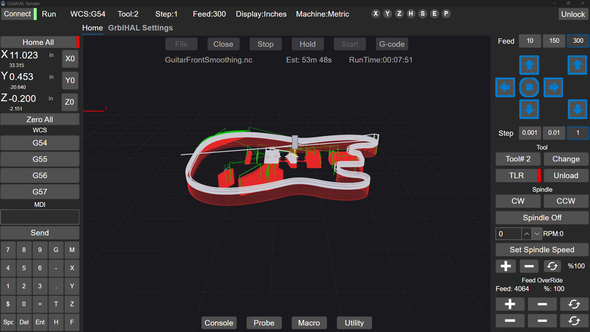
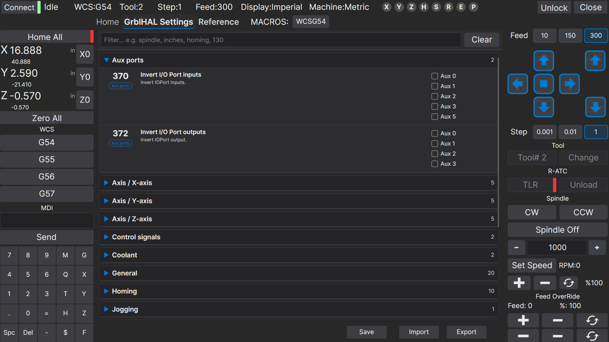
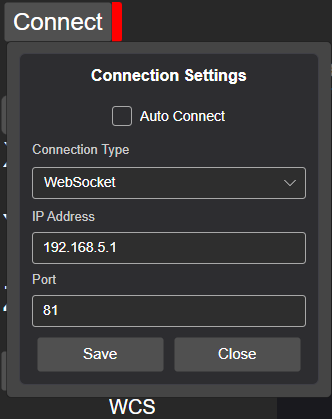
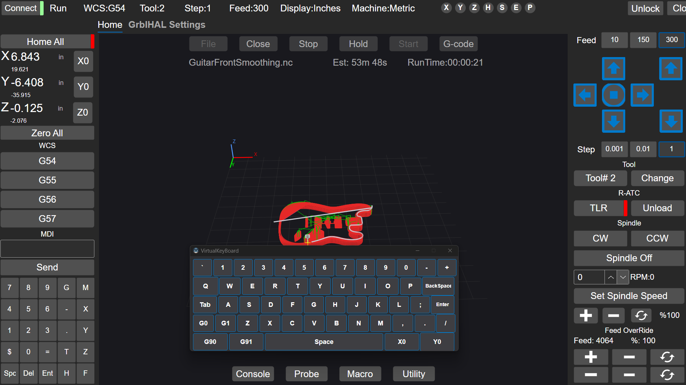
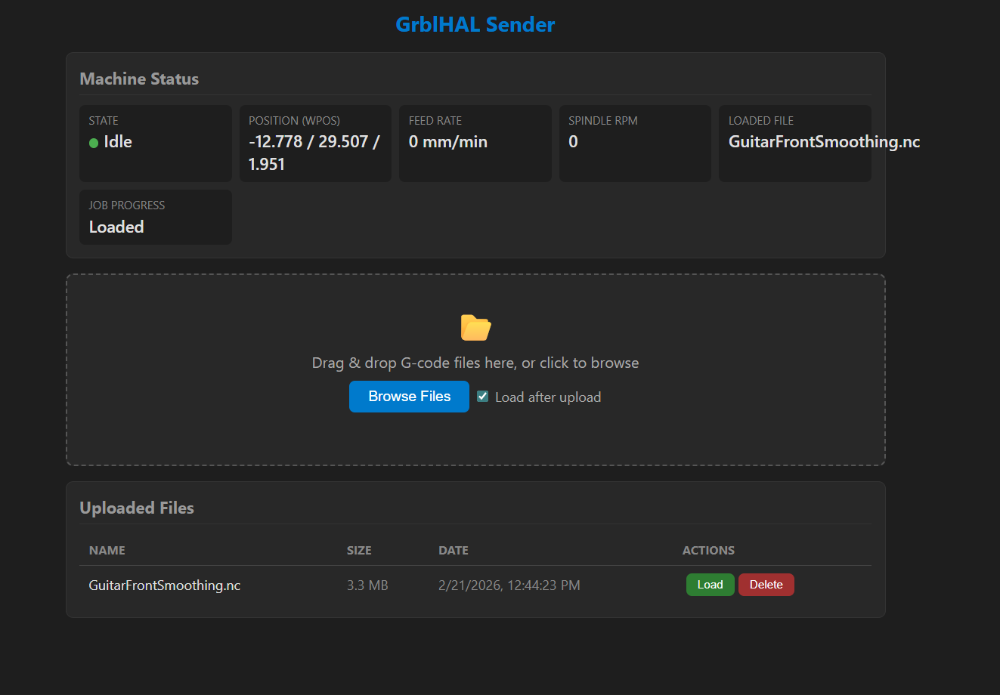
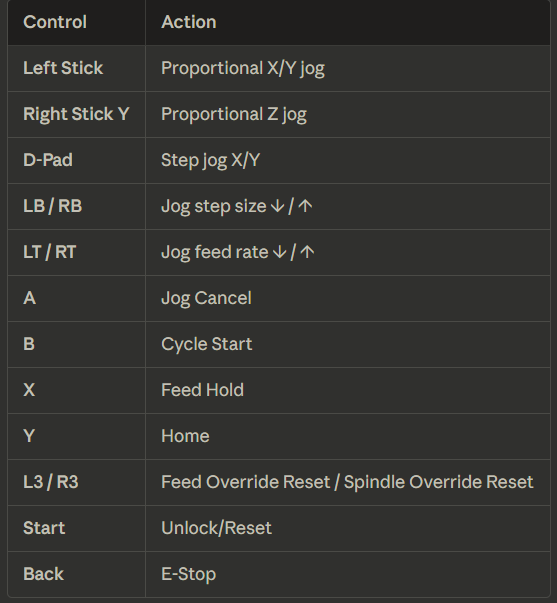
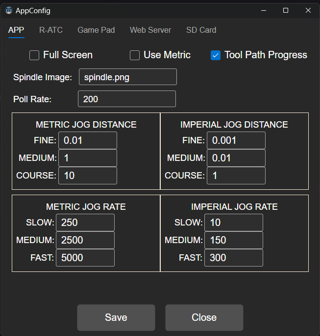
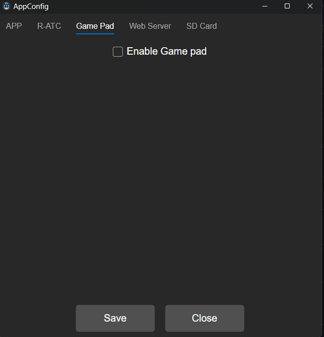
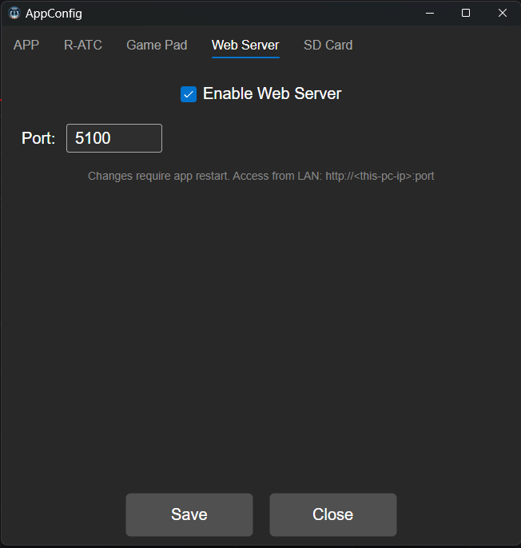
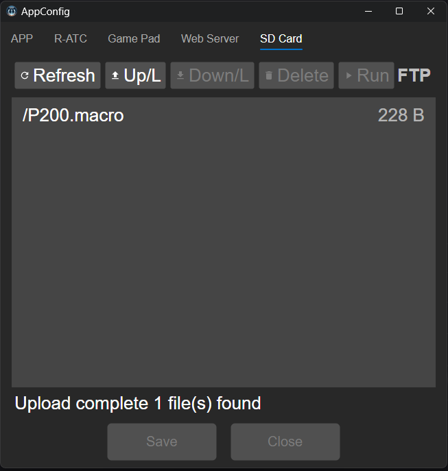

# Project is back Active

## GrblHal Sender a cross platform sender application  built using Avalonia UI and .Net

Goal was to create a application that will run on a cheap mini PC with a UI design that is touch monitor friendly, and will not require a mouse or keyboard to use.
 
---

 
## GrblHAL Setting supports export and import 

 
## Supports Serial, TCP, or WebSocket connection protocols.  Push and hold "Connect" to setup connection type and Auto Connect on app launch if desired 

 
## Double clicking any Text Fields brings up virtual keyboard

 
## Host local Web Server for remote file upload 

 
## Supports Wireless Controller

 
# Settings Overview
## App

 
## Rapid-ATC

 
## Wireess Gamepad(Setting work in progress)

 
## Web Server

 
## Macro Download and Upload Suppoer

### Priority  V1.0.1
