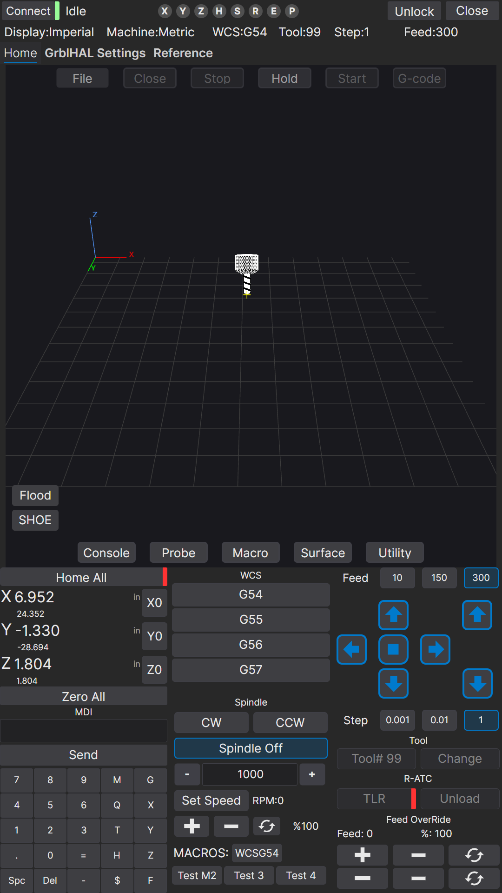
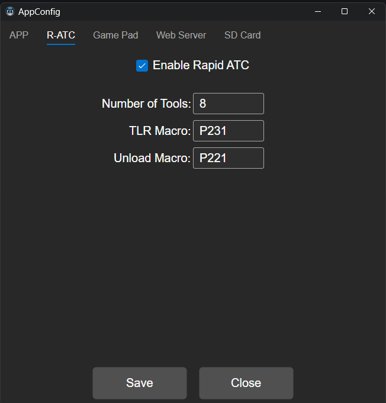
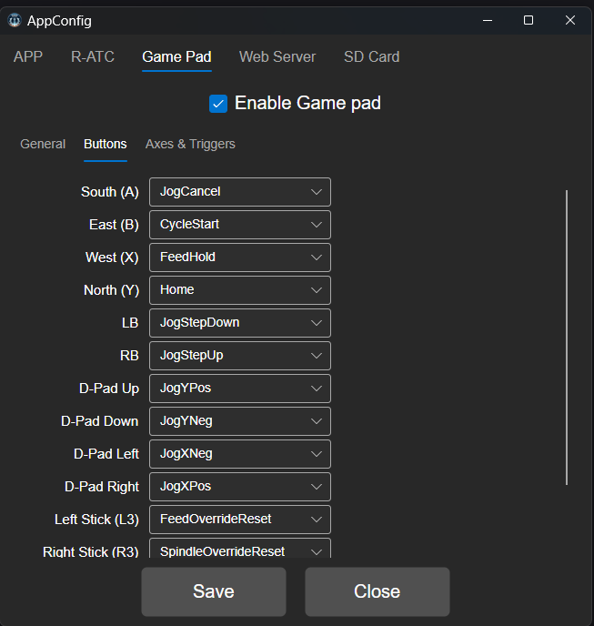
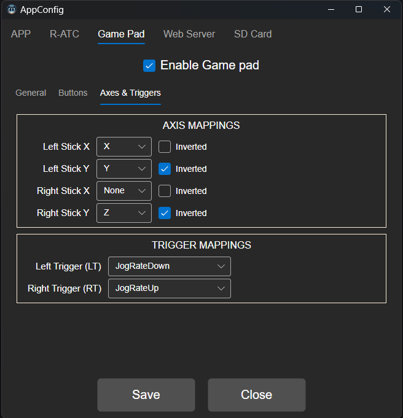
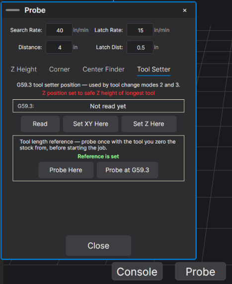
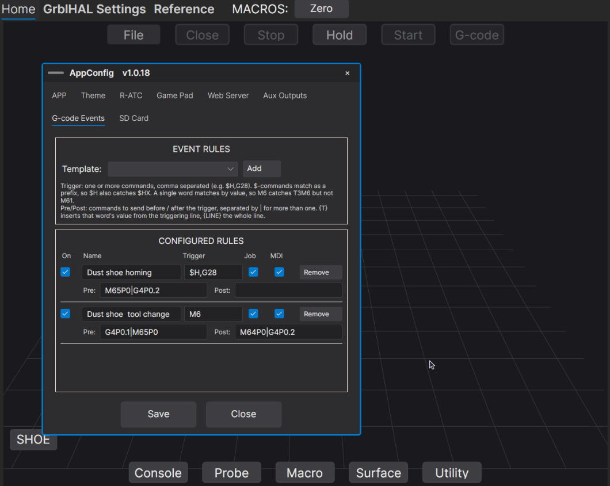
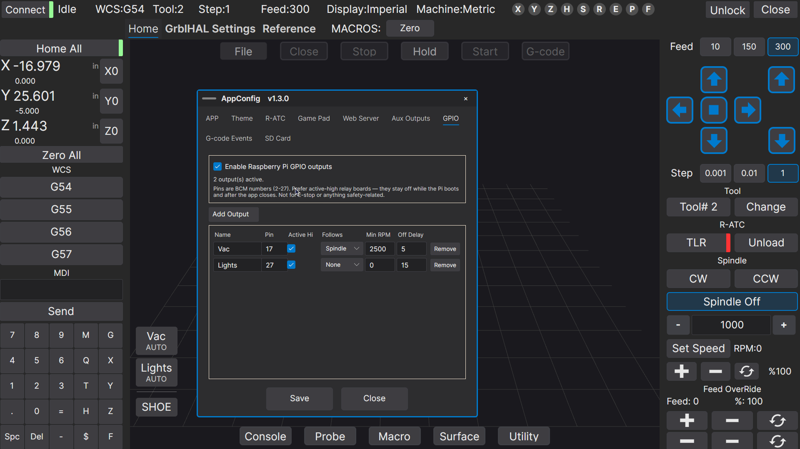

# GrblHAL Sender

A cross platform sender application for grblHAL, built using Avalonia UI and .NET.

The goal was an application that runs on a cheap mini PC, with a UI designed to be touch monitor friendly and usable without a mouse or keyboard.
</br>
---

</br>
## Runs on a portrait monitor as well as a landscape one

</br>
The layout follows the screen's orientation on its own — a 1920x1080 monitor gets the
landscape arrangement, a 1080x1920 one gets a portrait layout built for that shape. There is
nothing to set; rotate the display and restart.

Portrait is a different arrangement rather than a squeezed copy. The status strip splits over
two rows, the 3D view takes the full width, and the controls gather into a block along the
bottom — DRO and MDI on the left, work offsets, spindle and macros in the middle, jog pad on
the right — so everything sits within thumb reach on a rotated touchscreen.

Both layouts are assembled from the same panels, so a change to the jog pad or the DRO turns
up in both.
</br>
## GrblHAL Setting supports export and import 

</br>
## Supports Serial, TCP, or WebSocket connection protocols.  Push and hold "Connect" to setup connection type and Auto Connect on app launch if desired 

</br>
## Double clicking any Text Fields brings up virtual keyboard

</br>
## Host local Web Server for remote file upload 

</br>
## Supports Wireless Controller
 
</br>
# Settings Overview
## App

</br>
## Rapid-ATC

</br>
## Wireless Gamepad
  
</br>
## Web Server

</br>
## Macro Download and Upload Supported


# Tool Change

What the sender does at an `M6` depends on the controller's `$341` tool change mode. The
mode is read from the machine, so the relevant controls appear on their own — there is
nothing to configure in the app to match it. Changing `$341` while connected is picked up
as well, without a reconnect.

| `$341` | Mode | What the sender does |
|---|---|---|
| 0 | Normal | Pauses at the `M6`, acknowledges it, waits for **Start**. Your program is responsible for stopping the spindle, moving to the change position and restoring afterwards. |
| 1 | Manual touch off | As above, plus a **Touch Off** button |
| 2 | Manual touch off @ G59.3 | As mode 1, and needs the [tool setter position](#tool-setter-position-g593) set |
| 3 | Automatic touch off @ G59.3 | Pauses; the controller probes for itself on **Start**. Needs the tool setter position set. |
| 4 | Ignore M6 | No pause — the tool number is recorded and the program continues |

In every mode except 4 the machine reports `Tool` state, the sender acknowledges it
(`0xA3`) once on entry, and the program continues only when you press **Start**. It behaves
like an `M0` pause: the acknowledgement does not resume anything.

## Streaming stops at the tool change

The sender holds the rest of the file back when it sends an `M6`, and does not resume until
the controller reports the change finished. This matters because grblHAL rejects g-code
while a tool change is pending (`error:40`) — anything already sitting in its receive
buffer past the `M6` is discarded rather than queued, which on a short file can be the
whole remainder of the program.

While the job is paused there you can **jog freely** and use **MDI**, including as many
moves as you like; the file position does not advance and nothing is lost. Macro and probe
buttons stay disabled, since those would interleave into the program.

## Manual touch off (modes 1 and 2)

A **Touch Off** button appears beside the `TOOL` banner while the job is paused. It sends
`$TPW`, which probes the new tool and applies its length offset.

Every tool change: stop at the `M6` → change the tool → jog it over the reference surface →
**Touch Off** → **Start**.

## Tool length reference — do this before the job

`$TPW` applies the *difference* between this probe and the previous one, so it needs a
baseline. Set it once per session under **Probe → Tool Setter**, with the tool you are going
to zero the stock from:

- **Probe Here** — probes straight down from where the machine is standing; jog the tool
  over the setter first
- **Probe at G59.3** — retracts Z to machine zero, travels to the stored tool setter
  position, descends and probes

Either way the reference is set only if the probe actually makes contact. Then zero on the
stock and start the job, and every tool change from there needs nothing but **Touch Off**.

The panel says whether the controller currently holds a reference. On a good probe the tool
is backed off the trigger, and **Probe at G59.3** also returns to the X/Y it started from —
retracting Z to machine zero on the way and leaving it there, since the height it came from
may be down in the work.

> `$TLR` must follow a *successful* probe. Sent before one, or after a failed one, it clears
> the reference instead of setting it — which is why the app only issues it on a good probe.

Re-running it re-bases the datum onto whatever was last probed, so only do it deliberately —
after moving the tool setter, or re-zeroing against a different tool.

Touch plate thickness plays no part in this. The offset is a differential against the same
surface, so the thickness cancels out. Thickness only matters for setting workpiece Z zero,
which is a separate operation in the **Probe** dialog.

## Tool setter position (G59.3)

</br>
Modes 2 and 3 drive to the `G59.3` offset to reach the tool setter. Set it under
**Probe → Tool Setter**: jog the machine where you want it and store the position. X/Y and
Z are stored separately so neither overwrites the other by accident, and the stored value is
read back from the controller after each change so you can see what actually took effect.

> **The stored Z is where probing starts, not the tool setter surface.** The controller
> moves all three axes to `G59.3` and then probes downward by `$342`. Store Z at a safe
> clearance height above the setter — high enough for your longest tool, and no further
> above the setter than `$342`.

## Macro messages

Anything the controller says in words — including `(debug, ...)` output from a tool change
macro — is shown in the job panel, not only in the console. A macro that stops on
"manually unload the tool and unlock to continue" says so on screen.

# Probing

Every cycle probes twice: a fast pass at **Search Rate** to find the surface, then a slow one
at **Latch Rate** to measure it. **Distance** is how far a probe may travel looking for the
surface, and **Latch Dist** is how far it backs off between the two passes.

Probe moves are commanded in whatever units the display is set to, and the parser is handed
back the unit it was in when the cycle finishes.

Only the fields a cycle actually reads stay enabled, so what is greyed out is not being used.

## Probe type

| | |
|---|---|
| **Touch plate** | Work Z zero ends up the plate's thickness below where it triggered. |
| **3D probe** | **Diameter** compensates edge touches on the corner and centre cycles, and corrects the size they report. It plays no part in a Z probe — the ball meets a flat surface with its underside, directly beneath its centre, so where it triggers *is* the surface. |

## Z height

Position the probe above the surface and press **Probe Z**. Work Z zero is set at the surface,
and the stylus lifts clear by **Latch Dist** rather than being left resting on the work.

## Corner

Bring the probe to the corner, above the top face, and pick the corner that matches. Each leg
lifts to **Clearance Height**, moves clear of the stock on the axis it is about to probe while
stepping *in* on the other, drops by **Probe Depth**, and probes back toward the face. It
finishes lifted and standing over the corner it measured, which is now X0 Y0.

> **Probe Depth is measured from where you parked the stylus, not from the top of the stock.**
> If you sit 2mm above the face and want to touch 3mm down the side, Probe Depth is 5. Too
> shallow and the probe sweeps over the top of the edge and touches nothing.

The stand-off is Clearance Height, so Distance has to be comfortably larger than it for the
probe to reach the face.

## Center finder

**Bore** and **Rectangle** work from inside a hole or pocket. Position the probe roughly in
the middle, at the height you want it to touch at — these cycles never move Z, so Clearance
Height and Probe Depth do nothing and are greyed out. Distance has to cover the radius plus
however far off centre you started. Between legs the machine returns to the point you began
at, so a generous Distance is safe.

**Boss** and **Rect Boss** work from outside. Position the probe over the middle of the
feature and above its top face. Each leg stands off by half the approximate size plus
Clearance Height, drops by Probe Depth, and probes inward. A round boss takes one size; a
rectangular one takes a width and a height separately.

> **Keep Clearance Height larger than your eyeballing error.** Starting off centre adds to the
> stand-off on the far side and takes it away on the near side, so being out by more than the
> clearance puts the stylus over the feature when it drops. Under-estimating the approximate
> size eats the same margin. Over-estimating is safe — the probe simply travels further.

Y is probed from the X you started at rather than the measured centre. That is exact for a
rectangle, where a flat face reads the same anywhere along it, and leaves a small error on a
bore or boss if you started well off centre. Run it twice if that matters.

## When a probe misses

The cycle stops at the first missed contact rather than carrying on from a position that means
nothing, and says which datum it did not set. Nothing is written on a failure. A tool length
reference is the one worth spelling out: `$TLR` is not sent, so whatever reference the
controller was holding is still intact.

# G-code Events

</br>
Pre and post commands can be injected around any g-code event, configured under
**Utility → G-code Events**. The original use case is lifting a dust shoe out of the way for
a tool change or a homing cycle, but nothing about it is specific to that.

Each rule has a trigger and the commands to wrap it with:

- **Trigger** — one or more commands, comma separated, e.g. `$H,G28`. A `$` command matches
  as a prefix, so `$H` also catches `$HX`. A single word matches by value, so `M6` catches
  `T3M6` and `M06` but not `M61`.
- **Pre / Post** — commands to send before and after the trigger, separated by `|` for more
  than one. `{T}` inserts that word's value from the triggering line, `{LINE}` the whole line.
- **Job / MDI** — whether the rule applies to a streamed file, to commands you issue by
  hand, or both.

Rules are applied when a file is loaded, so reload the file after editing one.

## Getting the timing right in a job

grblHAL executes `M64`/`M65` when it *parses* them, which during a job is well ahead of the
cutting point — so a plain `M65P0` before an `M6` fires many blocks early, while the spindle
is still down and cutting.

A dwell forces the planner to drain before continuing, so putting one *first* moves the
output change to the right moment:

| | |
|---|---|
| `M65P0\|G4P0.2` | lifts early, then waits — wrong |
| `G4P0.1\|M65P0` | waits for the cut to finish, then lifts — right |

Aux output buttons follow these commands wherever they come from, so a rule that toggles a
pin moves the matching button too.

# Shop Outputs

</br>
The sender can switch relays for shop lights, dust collection — anything you would otherwise
reach over and flip. Configured under **Utility → GPIO**, and off by default: nothing is
driven until you enable it.

This is for convenience, not safety. E-stop and safety door belong hardwired to the
controller, where they do not depend on a userland app being responsive. Nothing here is
time-critical either — the outputs settle in the second or so after the machine state
changes, which is fine for a vacuum and useless for an interlock.

Worth knowing why this exists alongside the controller's own aux outputs: those are driven by
`M62`/`M64`, which grblHAL executes when it *parses* them, well ahead of the cutting point
during a job. That is why the [G-code Events](#getting-the-timing-right-in-a-job) section
needs dwell-first ordering. A shop output is not in the g-code stream at all, so "run the vac
while the spindle is cutting, then for fifteen seconds after" needs no such trickery.

## Where the outputs live

| Device | Needs | Notes |
|---|---|---|
| **PiHeader** | A Raspberry Pi | The Pi's own 40-pin header. No extra hardware. |
| **UsbSerial** | A microcontroller on USB | Works on any host the app runs on — mini PC, Mac, or a Pi. |

The USB option exists because the header option only ever serves installs that run on a Pi.
Both behave identically once configured; everything below applies to either unless it says
otherwise.

## Off / Auto / On

Each output is a button in the bottom-left of the workspace, above the controller's aux
output buttons. Tapping it cycles the mode. The ring around the button shows whether the
relay is actually energised, which is not the same thing as the mode — an output sitting in
Auto reads `AUTO` whether or not it happens to be on right now.

| Mode | Behaviour |
|---|---|
| **Auto** | Follows the machine. Skipped in the cycle for outputs with no follow source. |
| **On** | Held on regardless of the machine. This is the one for cleanup before and after a job. |
| **Off** | Held off. Takes effect immediately — it does not wait out the off delay. |

Unlike the aux output buttons these stay live while the controller is disconnected, because
running the vacuum with the machine idle or unplugged is most of the point of the manual mode.

## What Auto follows

| Follows | Source |
|---|---|
| **Spindle** | The controller's accessory (`A:`) field |
| **Connected** | Whether the controller is connected — reasonable for lighting |
| **None** | Manual only; the output has no Auto mode |

Spindle state is taken from the status report rather than by watching for `M3`/`M5` in the
stream, so it reflects what the machine is actually doing. It picks up a spindle you started
by hand from the console, and it stays honest when a job aborts part way through, where the
file position tells you nothing useful.

## Spindle threshold — for ATC tool changes

**Min RPM** is the speed at or above which the spindle counts as running. Leave it at `0` and
any spindle-on state qualifies.

It exists for automatic tool changers. A RapidChange ATC and similar turn the spindle at a
low speed to thread and unthread the holder — a genuine spindle-on state with no cutting and
no chips. Without a threshold the dust collector fires at every tool change. Set Min RPM
above your changer's speed and below your cutting speed, and tool changes stop triggering it.

The comparison uses the *programmed* speed — the `S` word from the status report — not tacho
feedback. That steps cleanly when a macro commands a speed, rather than sweeping through the
threshold on every spin-up and spin-down.

Speed is watched as well as direction, which matters at the end of a change: the program
returns to cutting speed with the spindle never stopping, so the direction does not change
across it. Dropping back under the threshold mid-job behaves like the spindle stopping and
goes through the off delay, so a change that fits inside the delay window never moves the
relay at all.

> The threshold reads whatever `S` value is currently in force, so a tool change macro that
> sets a low `S` and does not restore it will hold the output off until the program commands
> a speed again.

## Off delay

An output in Auto stays on for **Off Delay** seconds after its source goes inactive. This is
doing two jobs. It clears the hose of chips still in flight after a cut, and — more
importantly — it stops a program full of tool changes and `M5`/`M3` pairs from dropping and
re-closing a contactor every few seconds. Any fresh demand inside the window cancels the
pending switch-off, so a run of tool changes collapses into one continuous run.

Fifteen seconds is a sensible starting point. An explicit **Off** ignores the delay entirely.

## Wiring

On a Pi, pins are **BCM numbers**, 2–27. Avoid 2/3 (I²C, permanently pulled up), 7–11 (SPI)
and 14/15 (UART); 17, 22, 23, 24, 25, 27 are all clean, and the **Add Output** button hands
out unused ones in that order.

On a USB device, pins are that board's own numbering — `GP` numbers on a Pico — and the valid
range is reported by the device itself rather than assumed.

**Prefer an active-high relay board.** BCM 9–27 boot with a pull-down, so an active-high
board reads *off* while the Pi boots, while the app is starting, and after it exits or
crashes — the fail-safe state costs nothing. An active-low board inverts all of that and
wants an external pull-up to stay safe. Set **Active Hi** to match whichever you have.

Do not drive a relay coil from a pin directly; use an opto-isolated module, a MOSFET driver
or an SSR. And size the switching for the load — a shop vacuum's inrush will weld the
contacts of a generic 10 A relay board sooner or later, so drive a proper contactor with it.

## Pi header setup

The header GPIO is reached through libgpiod. Installing the tools package pulls the right
runtime library whichever release you are on, which matters because the library package was
renamed between Debian releases (`libgpiod2` on Bookworm, `libgpiod3` on Trixie):

```
sudo apt install gpiod
sudo usermod -aG gpio $USER
```

Log out and back in for the group to take effect. `gpiodetect` should report the 40-pin
header as `gpiochip0 [pinctrl-rp1]` on a Pi 5.

If the app cannot reach the hardware it says so on the GPIO config tab rather than failing
silently or crashing — the message is the underlying error, so it will tell you whether it is
a driver or a permissions problem. With no device reachable the outputs still appear and
toggle but switch nothing, which keeps the app usable for development.

## USB device setup

The device runs the PICOGPIO protocol, specified in
[docs/pico-gpio-protocol.md](docs/pico-gpio-protocol.md). A MicroPython reference
implementation for a Raspberry Pi Pico is in [firmware/pico/main.py](firmware/pico/main.py) —
about a hundred lines, and enough to use in earnest.

Flash MicroPython onto the board, then copy the script to it as `main.py` so it runs on boot
and owns the USB serial port instead of the REPL:

```
pip install mpremote
mpremote connect COM10 fs cp firmware/pico/main.py :main.py
mpremote connect COM10 reset
```

Then pick **Device: UsbSerial** and select the port. **Close any IDE connected to the board
first** — a serial port can only be held by one program, and Thonny in particular keeps the
handle after you disconnect, which shows up as "access is denied". **Reconnect** retries
without restarting the app, and also covers unplugging the device mid-session.

The app never scans ports. A grblHAL controller and a Pico both enumerate as `/dev/ttyACM*`
on Linux and are indistinguishable by name, so the port is always chosen explicitly and
nothing is written until the device identifies itself.

### The device watchdog

The protocol requires the device to drive every output inactive if the host stops talking to
it — five seconds in the reference implementation. This covers what the app cannot: the
application crashing, the cable being pulled, or the host sleeping while USB power stays up.
A host-side "turn everything off on exit" only works when the exit is orderly.

That makes a USB device arguably safer than the Pi header, where an app that dies leaves the
pins to their boot-time pull-down.

## Behaviour worth knowing

Losing the connection drops any output following the spindle. Status reports stop arriving
when the link goes down, so the last known spindle state is stale — left alone, a spindle
that happened to be running at that moment would hold the dust collector on indefinitely.

Closing the app drives every output off before it exits, so quitting cannot leave the vacuum
running. The mode each output was left in is saved, with one exception: an output that
follows something never comes back **On** after a restart. Returning from a power cut with
the dust collector latched on is not what anyone means by remembering a setting. Manual-only
outputs do restore On, so shop lights come back as you left them.

# Testing status

Runs on Windows and on Linux including the Pi 5, on landscape and portrait displays.

Verified on hardware:
- The portrait layout on a 1080x1920 screen, and the landscape one after the panels were
  refactored to be shared between the two
- Tool change streaming — the job holds at the `M6`, survives jogging during the pause, and
  resumes cleanly on **Start**
- Manual touch off (`$341=1` / `2`) — the **Touch Off** button and `$TPW`, including jogging
  to the setter and back mid-change
- Automatic touch off (`$341=3`)
- `M6T<n>` from the MDI with no file loaded
- Tool length reference and tool setter position (`G59.3`), including the return to the X/Y
  the probe started from
- Changing `$341` while connected — the controls follow without a reconnect
- G-code event injection around a tool change, including the dwell-first ordering
- GPIO shop outputs on a Pi 5 — a relay on BCM 17 following the spindle in Auto, and the
  manual On/Off override, with no spurious activation across two boot cycles
- Shop outputs over USB — a Pico running the MicroPython reference firmware, driven from a
  Windows host: identify handshake, pin claim and switching
- Serial connection and reconnection
- Single instance guard on Linux
- The probe cycles with a 3D probe — workpiece Z zero, all four corners, and centre finding
  inside a bore and outside a boss
