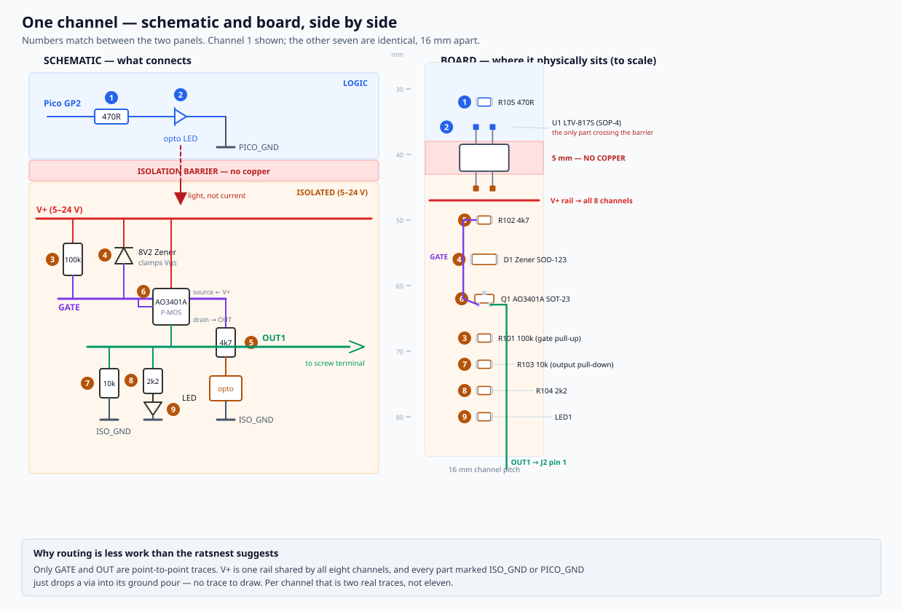
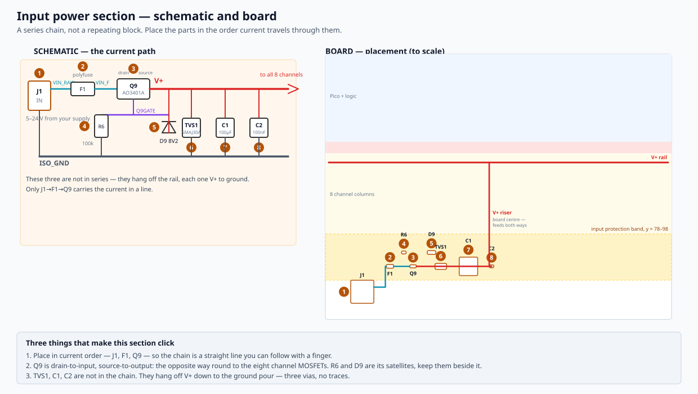

# Shop Output Board — layout plan

To be applied in Pcbnew after **Update PCB from Schematic** (F8), which imports all 84
footprints with the netlist. This is the part KiCad cannot do for you.

Board: **150 × 115 mm, 2 layers, 1oz copper.** Two layers is the cheap option at every
fab and there is nothing here that needs four.

## The one thing that matters

The isolation barrier is a strip across the board where **no copper exists on any layer**.
Everything above it is the Pico's domain; everything below it is the field domain. Get this
wrong and you have a board that passed ERC, passed the netlist check, and still has a ground
loop between the host PC and whatever the relays are bolted to.

Only the optocouplers cross it. They are gull-wing SOP-4, whose leads splay outward to a
9.38 mm pad span — wider than the DIP-4 equivalent, so the SMD part bridges the barrier more
comfortably than the through-hole one and leaves the board SMT-only apart from the connectors.

```
  y=0    ┌─────────────────────────────────────────────┐
         │  ○                                       ○  │   M3 corner holes
  y=5    │                                             │
         │        ┌───────────────────────────┐        │
         │        │      Pico socket          │        │   rows at y=7.00, y=24.78
  y=28   │        └───────────────────────────┘        │   (17.78 mm apart)
         │   R501  R502  R503 ... R508                 │   470R, one per channel
  y=35.8 │   ▄▄     ▄▄     ▄▄         ▄▄               │   opto pins 1,2  (LOGIC)
  y=38   ╞═════════════════════════════════════════════╡  ← barrier starts
         ║        N O   C O P P E R   —   5 mm         ║     optos centred y=40.5
  y=43   ╞═════════════════════════════════════════════╡  ← barrier ends
  y=45.2 │   ▀▀     ▀▀     ▀▀         ▀▀               │   opto pins 3,4  (ISOLATED)
         │   R2  D  Q  R1  R3  R4  LED  ×8 channels    │
  y=75   │                                             │
         │   F1  Q9  R6  D9  TVS1  C1  C2              │   input protection
  y=95   │                                             │
         │  [J1]      [J2 OUT1-4]    [J3 OUT5-8]       │   terminals, bottom edge
  y=115  │  ○                                       ○  │
         └─────────────────────────────────────────────┘
         x=0                                       x=150
```

### Why 5 mm, and why not more

SOP-4 pad rows are 9.38 mm apart with roughly 1.6 mm pads, leaving about 7.8 mm of clear
span. A 5 mm gap centred on the optos puts every pad **1.39 mm** outside the barrier. The
package would allow up to 7.8 mm, but the extra pad clearance is worth more here than a wider
gap — 5 mm is already far beyond what 24 V needs.

Electrically this is enormous. Neither side is mains, so this is functional isolation and 24 V
needs well under a millimetre of creepage. The 5 mm is buying noise separation and physical
obviousness, not safety margin.

A routed slot along the barrier is better still and costs extra at most fabs. It is optional
here; a copper gap is sufficient for what this board does.

## Channel placement



[channel-layout.svg](channel-layout.svg) draws a single channel both ways with the parts
numbered the same in each, which is the quickest way to see how the schematic becomes copper.
Regenerate it with `python generate_channel_diagram.py` — it reads the constants below, so it
cannot drift from this plan.

Eight columns on a **16 mm pitch starting at x = 15**: 15, 31, 47, 63, 79, 95, 111, 127.

Each column, top to bottom, matching the schematic so the two read the same way:

| Y | Part |
|---|---|
| 32 | R5*n* (470R) — logic side |
| 35.81 | opto pins 1, 2 |
| 45.19 | opto pins 3, 4 |
| 50 | R2*n* (4k7) |
| 56 | D*n* (Zener, SOD-123) |
| 62 | Q*n* (AO3401A, SOT-23) |
| 68 | R1*n* (100k) |
| 72 | R3*n* (10k) |
| 76 | R4*n* (2k2) |
| 80 | LED*n* |

Keep the LEDs on that one row so they read as a bank of eight indicators rather than
scattered. They are the only thing on this board a person looks at while it is running.

## Input power section



[power-layout.svg](power-layout.svg) draws this section both ways, same conventions as the
channel diagram. Regenerate with `python generate_power_diagram.py`.

Unlike a channel this is a **series chain**, so place the parts in the order current travels
through them and it stays readable:

| Part | X | Y | Note |
|---|---|---|---|
| J1 | 16 | 103 | Input terminal, bottom edge |
| F1 | 28 | 92 | Polyfuse |
| Q9 | 38 | 92 | Reverse polarity. **Drain to input, source to output** — opposite to the channel MOSFETs |
| R6 | 34 | 86 | Q9 gate satellites, own row just above it |
| D9 | 46 | 86 | |
| TVS1 | 50 | 92 | |
| C1 | 62 | 92 | 8 mm electrolytic, needs the space |
| C2 | 72 | 92 | Last part before the rail |

The **V+ riser at x = 71** carries the rail up from the chain to y = 47. That X is chosen
because it falls in the gap between channel columns 4 (x=63) and 5 (x=79) — a riser inside a
column would have to fight its way past R2, D and Q.

`TVS1`, `C1` and `C2` are **not in the chain.** Each one sits from `V+` down to the ground
pour, so they are three vias rather than three traces. Only `J1 → F1 → Q9` carries current in
a line.

## Net classes and design rules

Set two net classes, because they drive the DRC rule that enforces the barrier:

| Class | Nets |
|---|---|
| **Logic** | `PICO_GND`, `GP2`–`GP9`, `LEDA1`–`LEDA8` |
| **Isolated** | everything else — `V+`, `ISO_GND`, `VIN_RAW`, `VIN_F`, `Q9GATE`, `GATE1-8`, `OPTOC1-8`, `OUT1-8`, `LEDK1-8` |

`shop-output-board.kicad_dru` in this directory then enforces 5 mm between them. Copy it
beside the `.kicad_pcb` and KiCad picks it up automatically. **With that rule in place, a
trace that bridges the domains is a DRC error rather than something you have to spot.**

Widths:

| | Width |
|---|---|
| Signal (gates, opto, GP) | 0.25 mm |
| `V+`, `OUT1`–`OUT8` | 0.5 mm |
| Default clearance | 0.2 mm |
| Vias | 0.3 mm drill / 0.6 mm pad |

The 0.5 mm on the power and output nets is about mechanical robustness and low impedance,
not heating — the currents here are tens of milliamps.

## Ground pours

Two separate pours, both on both layers:

- `PICO_GND` fills the region above y = 38
- `ISO_GND` fills below y = 43
- Neither may enter the barrier. Set the zone outlines explicitly rather than relying on
  clearance to keep them out

**No stitching vias anywhere near the barrier**, and check the finished board with the DRC
rule above before generating Gerbers.

## Order of assembly

Worth placing in this sequence, because it front-loads the decisions everything else follows:

1. Terminals along the bottom edge — they are the largest parts and their positions are fixed
   by where wires need to enter
2. The Pico socket, centred, at the top
3. The eight optos on the barrier centreline — everything else in a channel hangs off these
4. Channel components in columns
5. Input protection last, filling the band between the channels and the terminals

## Before Gerbers

- Run DRC with the custom rule file present, and confirm zero violations
- Confirm the two pours have no connection anywhere — KiCad's net highlight on `PICO_GND`
  should light up nothing below the barrier
- Check the LED polarity against the footprint silkscreen; it is the easiest thing on the
  board to get backwards and it will not stop anything working, it just stays dark
- Take PCBWay's free DFM check
- **Order 5, not 50.** A footprint error costs one small run to find and nothing to fix

## Still not verified

None of this has been near a bench. The layout plan is geometry and reasoning, not a routed
board — and a routed board is the thing I cannot check. Breadboard one channel and confirm it
switches cleanly at 5 V and 24 V before any of this becomes copper.
